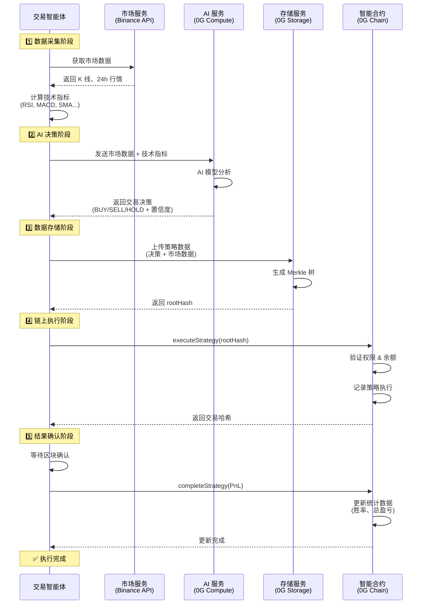
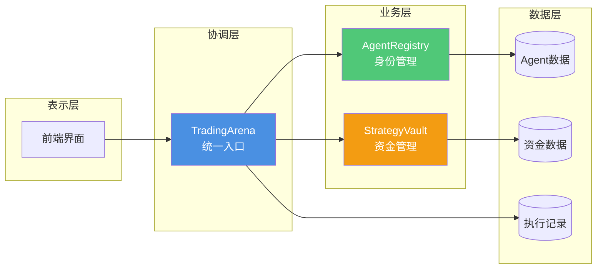
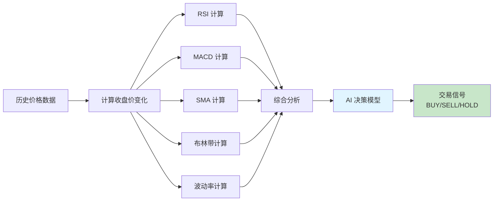
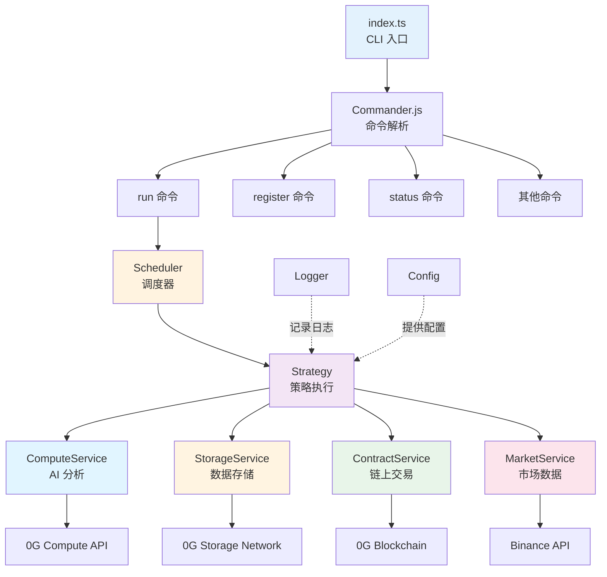
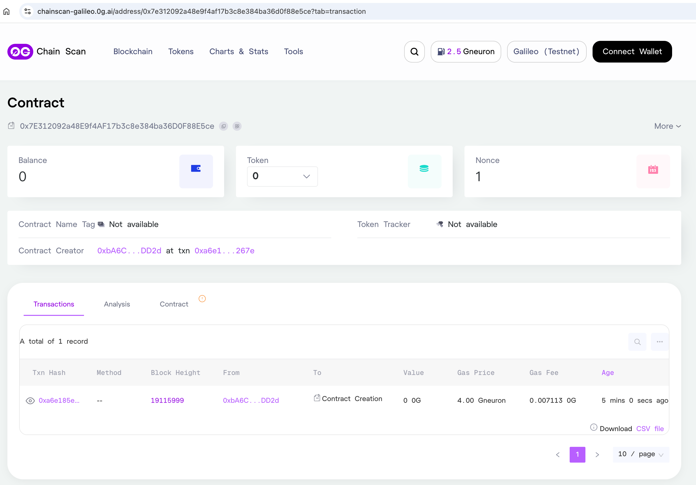

# 0g AI 交易智能体机器人

🤖 基于0G技术栈的AI自动化交易智能体 - 整合 0G Compute（AI 推理）、0G Storage（去中心化数据存储）和 0G Chain（智能合约执行）。

## 核心特性

- **🧠 AI 驱动分析**：利用 0G Compute 进行实时市场分析和交易决策
- **📦 去中心化存储**：在 0G Storage 上存储策略数据，具有可验证的根哈希
- **⛓️ 链上执行**：通过 TradingArena 智能合约执行交易
- **📊 实时市场数据**：从 Binance API 获取实时数据
- **⏰ 自动化调度**：支持基于 Cron 的自动执行
- **🎯 动量策略**：内置动量交易策略和技术指标分析

## 策略执行流程

智能体每次执行时遵循以下工作流程：



### 流程详解

#### 1️⃣ 数据采集阶段

- 从 Binance等API 获取实时市场数据
- 获取 K 线数据（1 小时周期）
- 计算技术指标：
  - **RSI(14)**：相对强弱指数
  - **MACD(12,26,9)**：指数平滑异同移动平均线
  - **SMA(20,50)**：简单移动平均线
  - **布林带**：价格波动率指标
  - **波动率**：收益率标准差

#### 2️⃣ AI 决策阶段

- 将市场数据和技术指标发送给 0G Compute
- AI 模型分析数据并生成决策
- 返回结果包括：
  - 交易动作：`BUY`（买入）/ `SELL`（卖出）/ `HOLD`（持有）
  - 置信度：0-100 分数
  - 决策理由

#### 3️⃣ 数据存储阶段

- 将策略数据上传到 0G Storage
- 数据包括：
  - 市场快照
  - AI 决策结果
  - 技术指标值
  - 时间戳
- 生成 Merkle 根哈希作为链上证明

#### 4️⃣ 链上执行阶段

- 调用 `executeStrategy()` 函数
- 传入参数：
  - `rootHash`：0G Storage 返回的根哈希
  - `symbol`：交易对（如 "BTCUSDT"）
  - `action`：交易动作
  - `amount`：交易金额
- 合约验证并记录策略执行

#### 5️⃣ 结果确认阶段

- 等待区块确认（通常 2-3 秒）
- 调用 `completeStrategy()` 更新盈亏
- 更新智能体统计数据

## 合约说明




## 使用指南

### 快速开始

```bash
# 1. 检查服务健康状态
pnpm dev health

# 2. 注册新的智能体
pnpm dev register --name "我的 AI 交易员" --description "动量交易机器人"

# 3. 在 .env 文件中填写返回的 AGENT_ID

# 4. 测试运行一次
pnpm dev run --once

# 5. 启动自动化交易
pnpm dev run
```

### CLI 命令详解

#### 🚀 `run` - 启动交易智能体

启动智能体，可以选择自动调度或单次执行。

```bash
# 启动自动调度模式（使用 .env 中的 CRON_SCHEDULE）
pnpm dev run

# 执行一次后退出
pnpm dev run --once

# 自定义调度频率（每 10 分钟执行一次）
pnpm dev run --schedule "*/10 * * * *"

# 指定智能体 ID
pnpm dev run --agent-id 1
```

**Cron 表达式示例：**

- `*/5 * * * *` - 每 5 分钟
- `0 * * * *` - 每小时整点
- `0 9,15,21 * * *` - 每天 9:00、15:00、21:00
- `0 0 * * 1` - 每周一午夜

#### 📝 `register` - 注册新智能体

在 TradingArena 合约上注册一个新的交易智能体。

```bash
# 使用交互式提示注册
pnpm dev register

# 使用参数直接注册
pnpm dev register --name "Alpha Bot" --description "高频交易机器人"
```

**注册后会返回：**

- 智能体 ID（需要填写到 .env 的 `AGENT_ID`）
- 交易哈希
- 智能体信息

## 技术指标说明

动量策略使用以下技术指标进行市场分析：

### 📊 指标详解

| 指标                                | 参数                                | 说明                     | 交易信号                                                     |
| ----------------------------------- | ----------------------------------- | ------------------------ | ------------------------------------------------------------ |
| **RSI**<br/>相对强弱指数            | 周期: 14                            | 衡量价格变动的速度和幅度 | RSI > 70: 超买（卖出信号）<br/>RSI < 30: 超卖（买入信号）    |
| **MACD**<br/>指数平滑异同移动平均线 | 快线: 12<br/>慢线: 26<br/>信号线: 9 | 趋势跟踪动量指标         | MACD 上穿信号线: 买入<br/>MACD 下穿信号线: 卖出              |
| **SMA**<br/>简单移动平均线          | 短期: 20<br/>长期: 50               | 平滑价格波动，识别趋势   | 价格 > SMA20 > SMA50: 上涨趋势<br/>价格 < SMA20 < SMA50: 下跌趋势 |
| **布林带**<br/>Bollinger Bands      | 周期: 20<br/>标准差: 2              | 价格波动范围             | 价格触及上轨: 可能回调<br/>价格触及下轨: 可能反弹            |
| **波动率**<br/>Volatility           | 周期: 20                            | 价格变化的标准差         | 高波动率: 高风险高收益<br/>低波动率: 市场稳定                |

### 📈 指标计算示例



### 🎯 动量策略逻辑

动量策略基于以下规则：

1. **买入条件**（需同时满足）：
   - RSI < 40（相对低位）
   - MACD > 信号线（上升动量）
   - 价格 > SMA20（短期趋势向上）
   - AI 置信度 > 70%

2. **卖出条件**（满足任一）：
   - RSI > 70（超买区域）
   - MACD < 信号线（下降动量）
   - 价格 < SMA20（短期趋势向下）
   - AI 置信度 > 70%

3. **持有条件**：
   - 信号不明确
   - 置信度 < 70%
   - 市场波动过大

## 核心模块说明



# 测试

## 合约部署

https://chainscan-galileo.0g.ai/address/0x7e312092a48e9f4af17b3c8e384ba36d0f88e5ce

```bash
  AgentRegistry: 0x7E312092a48E9f4AF17b3c8e384ba36D0F88E5ce
  StrategyVault: 0xa6b366551740f531EA278Bf5ee826e6C26845e86
  TradingArena: 0x07e47619BaA35fB69F2Bca3954970ffD0Bd85754
```



## 健康检查

```
pnpm dev health

> ai-trading-agent@1.0.0 dev /root/Study/fullstack/@Hackathon@/2026.01.31_0G_AI_Vibe_Coding/idea/agent
> tsx src/index.ts health


🏥 Health Check

════════════════════════════════════════
2026-01-31 06:44:20 [info] {"service":"ComputeService","address":"0xbA6C51365c39559AF7024F697C19b2487ef2DD2d","providerAddress":"0x69Eb5a0BD7d0f4bF39eD5CE9Bd3376c61863aE08"}: ComputeService created
2026-01-31 06:44:20 [info] {"service":"StorageService","address":"0xbA6C51365c39559AF7024F697C19b2487ef2DD2d","indexerUrl":"https://indexer-storage-testnet-turbo.0g.ai"}: StorageService initialized
2026-01-31 06:44:20 [info] {"service":"ContractService","contractAddress":"0x07e47619BaA35fB69F2Bca3954970ffD0Bd85754","signerAddress":"0xbA6C51365c39559AF7024F697C19b2487ef2DD2d"}: ContractService initialized

🔍 Checking services...

   ✅ 0G Chain: Connected (Balance: 5.986669904830762218 0G)
2026-01-31 06:44:20 [info] {"service":"ComputeService"}: Initializing 0G Compute Broker...
2026-01-31 06:44:20 [info] {"service":"ComputeService"}: Broker created successfully
2026-01-31 06:44:20 [warn] {"service":"ComputeService","error":"invalid BigNumberish value (argument=\"value\", value=null, code=INVALID_ARGUMENT, version=6.16.0)"}: Could not check ledger balance, continuing anyway
2026-01-31 06:44:21 [info] {"service":"ComputeService","count":3,"providers":["0xf07240Efa67755B5311bc75784a061eDB47165Dd","0x3feE5a4dd5FDb8a32dDA97Bed899830605dBD9D3","0x6D233D2610c32f630ED53E8a7Cbf759568041f8f"]}: Available providers
2026-01-31 06:44:21 [warn] {"service":"ComputeService","configured":"0x69Eb5a0BD7d0f4bF39eD5CE9Bd3376c61863aE08","available":["0xf07240Efa67755B5311bc75784a061eDB47165Dd","0x3feE5a4dd5FDb8a32dDA97Bed899830605dBD9D3","0x6D233D2610c32f630ED53E8a7Cbf759568041f8f"]}: Configured provider not found in available services
2026-01-31 06:44:21 [info] {"service":"ComputeService","from":"0x69Eb5a0BD7d0f4bF39eD5CE9Bd3376c61863aE08","to":"0xf07240Efa67755B5311bc75784a061eDB47165Dd"}: Auto-selected first available provider
Provider signer already acknowledged
2026-01-31 06:44:22 [info] {"service":"ComputeService"}: Provider acknowledged successfully
2026-01-31 06:44:22 [info] {"service":"ComputeService"}: ComputeService initialization complete
   ✅ 0G Compute: Online
   ✅ 0G Storage: Online
   ✅ CoinGecko API: Online
```

## 注册智能体

```
📝 Registering new agent...

2026-01-31 06:48:32 [info] {"service":"ContractService","contractAddress":"0x07e47619BaA35fB69F2Bca3954970ffD0Bd85754","signerAddress":"0xbA6C51365c39559AF7024F697C19b2487ef2DD2d"}: ContractService initialized
   Name: 我的 AI 交易员
   Description: 动量交易机器人
   Model: 0G Compute - DeepSeek
   Owner: 0xbA6C51365c39559AF7024F697C19b2487ef2DD2d

🔄 Sending transaction...
2026-01-31 06:48:32 [info] {"service":"ContractService","name":"我的 AI 交易员"}: Registering agent
2026-01-31 06:48:34 [info] {"service":"ContractService","txHash":"0x66a4b2774f27cb4b05e403aedd15a06bc58b8677ee3e55f157cf004561bfbc2a"}: Register transaction sent
2026-01-31 06:48:43 [info] {"service":"ContractService","agentId":"6","txHash":"0x66a4b2774f27cb4b05e403aedd15a06bc58b8677ee3e55f157cf004561bfbc2a"}: Agent registered successfully

✅ Agent registered successfully!
   Agent ID: 6
   TX Hash: 0x66a4b2774f27cb4b05e403aedd15a06bc58b8677ee3e55f157cf004561bfbc2a

💡 Add this to your .env file:
   AGENT_ID=6
```

## 查看余额


## 账本充值

```
pnpm run compute --add 5

💸 Adding 2 0G to ledger...

2026-01-31 15:41:17 [info] {"service":"ComputeService","amount":2}: Adding funds to ledger
sending tx with gas price 4000000007n
tx hash: 0x0165ec3f6799e6edd3ffe7e5cfb32d8abb8a0e9e96d9ddc58164f820ef079e3a
2026-01-31 15:41:34 [info] {"service":"ComputeService"}: Funds deposited successfully
✅ Funds deposited to ledger!

⏳ Waiting for blockchain confirmation...

🔄 Transferring funds to provider (0xf07240Efa67755B5311bc75784a061eDB47165Dd)...

2026-01-31 15:41:37 [info] {"service":"ComputeService","amount":"1.600000000000000089"}: Transferring funds to provider
sending tx with gas price 4000000007n
tx hash: 0x53bb0e17b52853077734879212f5ec0039274ededa09460745d06897e780aa17
2026-01-31 15:41:50 [info] {"service":"ComputeService"}: Transfer completed successfully
✅ Transferred 1.600000000000000089 0G to provider!

💰 Final Balances:
   Wallet: 4.975549556811301636 0G
   Ledger: 3.397039600000000078 0G
   Provider: 0xf07240Efa67755B5311bc75784a061eDB47165Dd
```


## HOLD


## SELL


